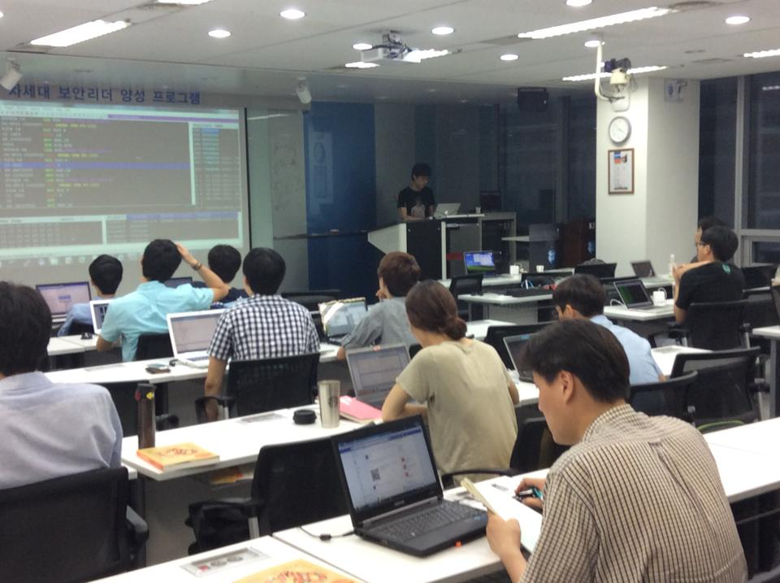

# 으으리 리버싱 파으리썬 웹해으킹

<!--  -->

## Season1 Pictures

## Season3

- 기간: 2015.02.08(일)
- 시간: 10:00 ~ 18:00
- 장소: [토즈 선릉점](http://www.toz.co.kr/branch/main/index.htm?id=12)
- 인원: 약 20명
- 비용: 1만원(점심, 주전부리)
- 내용: 악성코드 분석(리버싱 중급)

### [악성코드 분석 소개](reversing/season3/00.md)

## 등록하는 곳

- [리버싱 등록](http://onoffmix.com/event/40953)
- 온오프믹스에 등록하여 주시기 바랍니다.

## 비용

- 1만원(점심, 주전부리)
- 원래는 2만원을 받아서 환급을 해주었는데 환급 해주는데 개설자의 개인 시간이 너무 많이 들어가기에 점심, 주전부리 비용으로 대체합니다. 어차피 8시간 강의라 점심을 먹어야 하고 약간의 간식 제공합니다.
- 몇회 운영을 해보았는데 개인적인 사정(?)이 많아서 실제 참여하시는 분들은 반절 밖에 되지 않아 취하는 조치입니다. 최소한의 서로에 대한 약속으로 생각해 주시면 되겠습니다.
- 참석하시지 않을 경우에는 환불이 불가함을 알려 드립니다.

### [향후 일정](pages/calendar.md)